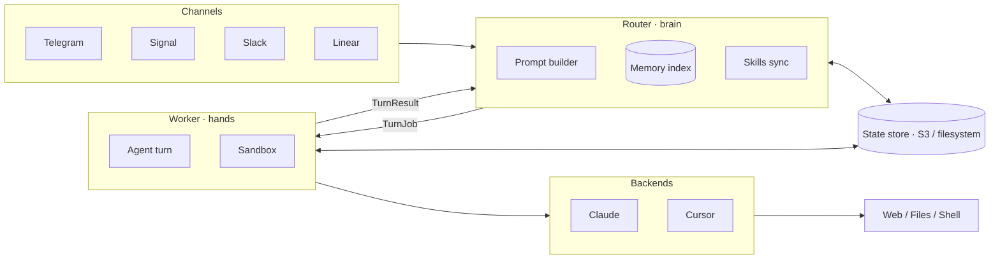

# Cica

An agentic AI assistant that lives in your chat.

Cica brings an AI agent (Claude or Cursor) to your messaging apps. It holds conversations, answers questions, runs commands, reads and writes files, remembers things about you, and learns new skills over time.

It runs two ways from the same binary:

- **Single-box** — one process on your machine or a small VM. Simplest setup; everything lives on local disk.
- **Cloud** — a long-lived **router** that orchestrates conversations and a fleet of **ephemeral workers** that each run one agent turn in an isolated sandbox, coordinated through a shared state store (S3 or filesystem). This is how you scale Cica safely and give the agent a disposable, sandboxed environment to act in.

See [docs/architecture.md](docs/architecture.md) for how cloud mode works.

## Features

- **Multi-channel** — Telegram, Signal, Slack, or Linear (`@mention` an agent on a ticket).
- **Multi-user** — each user gets their own agent identity and memory; skills are shared.
- **Continuous conversations** — context persists across messages.
- **Memory** — remembers important things about each user across conversations (semantic search over saved notes).
- **Skills** — extensible through skills, optionally git-synced from a central repo.
- **Two deployment modes** — the same binary runs single-box or as a distributed router + worker fleet.
- **Pluggable backends** — Claude (via the Anthropic API or Vertex AI) or Cursor.

## Requirements

- macOS (Apple Silicon) or Linux.
- A backend: an Anthropic API key / Claude subscription, or a Cursor API key.

## Installation

```bash
curl -fsSL https://raw.githubusercontent.com/oxiglade/cica/main/install.sh | sh
```

Or with Cargo:

```bash
cargo install --git https://github.com/oxiglade/cica
```

### Building from source

```bash
git clone https://github.com/oxiglade/cica
cd cica
cargo build --release
./target/release/cica
```

Cica is a binary crate. Run the tests with `cargo test --bin cica`. The S3 store and Fargate launcher are behind the `s3` and `fargate` cargo features.

## Getting started (single-box)

```bash
cica init   # setup wizard: pick channels + backend, download deps
cica        # start the assistant
```

Then message your bot. On first contact you'll go through a quick pairing flow; approve new users from the host:

```bash
cica approve <pairing-code>
cica paths            # show where data is stored
```

## Commands

| Command | What it does |
|---|---|
| `cica` | Run the assistant (router): start channel listeners, the cron scheduler, and the skills sync loop. |
| `cica init` | Setup wizard — add channels, choose a backend, fetch local dependencies. |
| `cica approve <code>` | Approve a pending pairing request by its code. |
| `cica paths` | Print all data directory paths. |
| `cica worker --turn <id>` | Run a single turn as a one-shot worker. Internal — the router invokes this on workers in cloud mode; you don't call it directly. |

## Configuration

Configuration lives in `config.toml` in your platform config directory (`cica paths` shows the exact location). A minimal single-box setup needs a channel and a backend key; cloud mode adds a `[deployment]` block and (optionally) a `[skills]` block.

See **[docs/configuration.md](docs/configuration.md)** for the full reference and **[config.example.toml](config.example.toml)** for a copy-pasteable starting point.

## How it works

- **Single-box:** channels feed messages to an in-process agent; sessions, memory, and skills live on local disk.
- **Cloud:** the router builds each turn's prompt and dispatches it to a worker; the worker hydrates session + memory + skills from the state store, runs the agent in a sandbox, and writes results back. Workers are stateless and disposable.

The full model — the per-turn hydrate→run→dehydrate loop, the provider options (local / subprocess / docker / fargate), the state-store key layout, skills git-sync, and the memory write-back loop — is documented in **[docs/architecture.md](docs/architecture.md)**.



In single-box mode the router and worker are the same process and the state store is optional.

## License

Licensed under either of Apache License, Version 2.0 or MIT license at your option.
